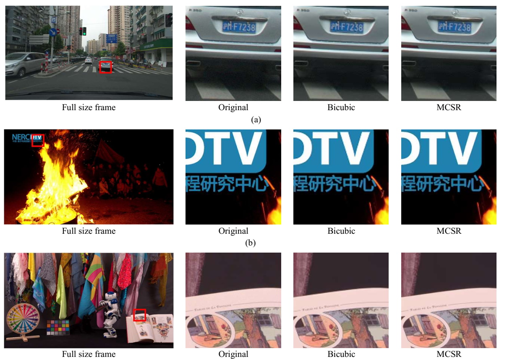

## Overview
This is a tensorflow implementation of ["Low-Complexity Intra Coding in Versatile Video Coding"]( https://ieeexplore.ieee.org/document/9690615), a deep learning based 10-bit image Super-Resolution model.

This network is used to unsample and enhance quality of compressed 10-bit image in VVC.
With each QP in {22,27,32,37}, we have corresponding datasets and pre-trained weight.

With 10-bit YUV, we extract it into 16-bit *.png images. Then, our network will be done in  16-bit images. In order to apply this network in VVC,

LR 10-bit YUV --> LR 16-bit png --> MCSR --> HR 16-bit png --> HR 10-bit YUV 

## Sample result



## Requirements

python >= 3.6
tensorflow >= 2.1.0, scipy, numpy, pillow, imageio, and scikit-image


## Result of PSNR

The sample result of default parameter is here. The model is trained by custom BIV-DVC, a 16-bit image dataset.


## Apply to your own image
 
Execute **sr.py** to generate high resolution images. 

Line 63-66 to point the checkpoint directory for each QP network.

**orgpath** is input image directory of all extract sequences.
**out_path** is the output directory to save png image.


```
python .\sr.py 
```

## Convert 16-bit png images to 10-bit YUV

All setting is shown in **rgb2yuv_ffmpeg_vvc.py**. Change the **orgpath**, **out_path** and **size**.

```
# Convert png images to YUV sequence.
python rgb2yuv_ffmpeg_vvc.py

```
## Convert 10-bit YUV to 16-bit png images
All setting is shown in **yuv2rgb_ffmpeg.py**. Change the **orgpath**, **out_path** and **size**.

```
# Convert png images to YUV sequence.
python yuv2rgb_ffmpeg.py

```

## How to train with your own dataset
We have 5 BIV-DVC datasets with 5 QP {22,27,32,37,42}. Put all data in dataset directory.

First, we need to extract data to batch_data by using **extract_data.py**. 
Modify **QP** and **batch_image size run** in **extract_data.py**. This process takes long time.


```
# Extract batch data for training.
python extract_data.py

```

When it completed, the batch_data is generated with corresponding training data. For example, with **QP=42**, we have training data in **'./batch_data/BVI_42/'**
Modify **folder_checkpoint** in line 144 to change weight directory.

```
# Start traning.
python train.py

```

# Important parameters

The number of filter is fixed **layer= np.array([48, 48, 24, 24, 24, 12, 12, 8],dtype=np.int)**.